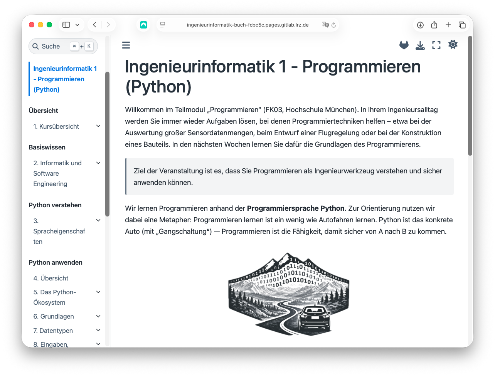

# Ingenieurinformatik 1 – Programmieren (Python)

Dieses Repository bildet die Grundlage der interaktiven Lern-Website zur Veranstaltung *Ingenieurinformatik 1 – Programmieren (Python)*:  
-> [Zur Website](https://ingenieurinformatik-buch-fcbc5c.pages.gitlab.lrz.de/intro.html)

Ziel ist es, Studierenden einen praxisnahen und aktiven Zugang zum Programmieren zu ermöglichen.  
Das Vorlesungsskript ist so gestaltet, dass Beispiele nicht nur gelesen, sondern **direkt ausgeführt, verändert und experimentell erkundet** werden können. 

Ergänzend steht ein PDF-Skript zum Nacharbeiten und zur gezielten Prüfungsvorbereitung zur Verfügung (Download über die Website).

## Vorteile für Studierende

Der Einstieg ist bewusst niedrigschwellig gestaltet: 

- Python-Code kann **ohne lokale Installation direkt im Browser** ausgeführt werden. 
- Das Ziel ist das aktive Lernen zu fördern: Studierende können Beispiele direkt selbst nachvollziehen, Varianten ausprobieren und Auswirkungen unmittelbar beobachten.

Über den JupyterHub der Hochschule München besteht zudem die Möglichkeit, eigene Anpassungen an den Code-Beispielen zu speichern und später weiterzubearbeiten. Damit wird ein kontinuierliches, semesterbegleitendes Arbeiten unterstützt.

Alle Inhalte sind zusätzlich als **PDF-Skript** verfügbar, das sich insbesondere zum Nacharbeiten, Markieren und Wiederholen eignet (Download über die Website unter *Downloads*).

Inhaltlich liegt der Schwerpunkt auf grundlegenden Programmierkompetenzen, die **über Python hinaus** relevant sind und sich auf andere Programmiersprachen übertragen lassen. 
Dazu zählen unter anderem:

- das strukturierte Entwickeln von Algorithmen, 
- der bewusste Umgang mit Syntax und Semantik, 
- systematisches Vorgehen (Debugging, Testing),
- sowie das Lesen, Verstehen und Bewerten von bestehendem Code.

## Programmieren lernen in Zeiten von LLMs

Große Sprachmodelle (LLMs) können das Programmieren unterstützen, ersetzen jedoch kein fundiertes Verständnis:  
Robuste Software entsteht nicht allein durch Prompts, sondern erfordert klare Anforderungen, saubere Integration, Tests und fachliche Verantwortung.

Im Kurs werden KI-Werkzeuge daher gezielt als **Lernunterstützung** eingesetzt – etwa zur Reflexion von Lösungsansätzen, zum Stellen der richtigen Rückfragen oder zur Überprüfung eigener Ergebnisse. Ziel ist es, methodische Kompetenz und Verständnis aufzubauen, statt diese durch automatisch erzeugten Code zu substituieren.

Dieser Ansatz ist auch wissenschaftlich gut belegt: Studien zeigen, dass der Einsatz von KI als Lerncoach die benötigte Lernzeit reduzieren kann, bei vergleichbarem Lernerfolg (z. B. Bassner et al., 2025).

Weiterführende Informationen finden sich im Kurskapitel:  
[Programmieren lernen in Zeiten von LLMs](https://ingenieurinformatik-buch-fcbc5c.pages.gitlab.lrz.de/chapters/01-course-overview/40-learningLLM.html)

## Für Beitragende

Das Repository ist auf kollaborative Weiterentwicklung ausgelegt und senkt bewusst die technischen Einstiegshürden:

- **Bearbeitung im Browser**: Viele inhaltliche Änderungen (Text, Aufgaben, Beispiele) können direkt über die GitLab-Weboberfläche vorgenommen werden – ohne lokale Entwicklungsumgebung oder Softwareinstallation.
- **Automatisierte Builds und Deployments**: GitLab CI übernimmt den Aufbau und die Veröffentlichung der Website. Lokale Builds sind optional und primär für Maintainer relevant.

## Links

- **Website (GitLab Pages)**:  
  https://ingenieurinformatik-buch-fcbc5c.pages.gitlab.lrz.de/intro.html  
- **Feedback / Verbesserungsvorschläge**:  
  https://gitlab.lrz.de/fk03ingenieurinformatik/Ingenieurinformatik-buch/-/issues  
- **Software-Dokumentation für Maintainer (Build / CI / Repositories)**:  
  [`docs/README.md`](./docs/README.md)
