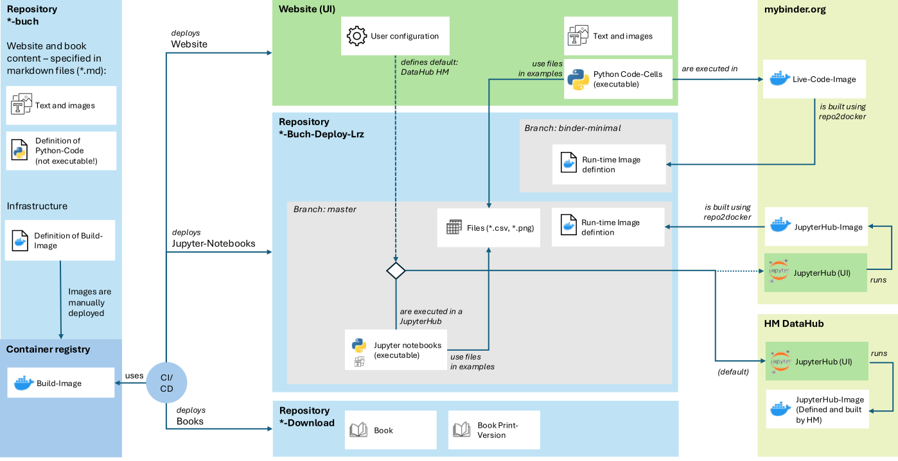

# Systemarchitektur

## Überblick

Die Plattform besteht aus drei Git-Repositories mit klar getrennten Verantwortlichkeiten:

- **Arbeits-Repository (`Ingenieurinformatik-buch`)**: Enthält die Quellen (MyST/Markdown, Konfiguration, Skripte, Assets) und baut per GitLab CI die Website sowie PDF-Artefakte. Zusätzlich werden aus den Quellen **ausgeführte Notebooks** erzeugt.
- **Deployment-Repository (`ingenieurinformatik-buch-deploy-lrz`)**: Enthält die **ausführbaren Artefakte** (Notebooks und Runtime-Definitionen) für Binder/Thebe und Notebook-Workflows. Es wird automatisiert vom Arbeits-Repository befüllt und ist **kein** Arbeits-Repo. -> link: https://gitlab.lrz.de/fk03ingenieurinformatik/ingenieurinformatik-buch-deploy-lrz
- **Download-Repository (`ingenieurinformatik-download`)**: Stabile Ablage für **PDF-Downloads** (u. a. „Skript-aktuell.pdf“). Es wird automatisiert aus der CI des Arbeits-Repos aktualisiert. Das **aktuelle PDF-Skript ist auf der Website verlinkt**. -> https://gitlab.lrz.de/fk03ingenieurinformatik/ingenieurinformatik-download

Die Website bietet beim „Notebook öffnen“ eine Auswahl, zu welchem JupyterHub der Nutzer weitergeleitet wird:
- **mybinder.org** (aktuelle Pakete, Image aus Repo-Definition gebaut/aus Cache)
- **JupyterHub der Hochschule München (Datahub)** (stabile, von HM verwaltete Images)

## Nutzungspfade und Runtime-Entscheidung

Das Diagramm zeigt zwei getrennte Konzepte:

1. **Artefakt-Fluss (CI/CD)**  
   Inhalte werden im Arbeits-Repo (*-buch) gepflegt und per CI in verschiedene Artefakte überführt:
   - Website (GitLab Pages)
   - PDFs (voll & print) → Deployment ins Download-Repo
   - ausführbare Notebooks → Deployment ins Deployment-Repo

2. **Laufzeit-Fluss (Nutzerzugriff)**  
   Je nach Auswahl (Live Code oder Notebook-Option + Anbieter) werden unterschiedliche Laufzeitumgebungen verwendet:
   - Bei **mybinder.org** wird das Image auf Basis der Definition im Deployment-Repo gebaut (oder aus Cache genutzt). Ziel: möglichst aktuelle Pakete ohne manuelle Versionskontrolle.
   - Beim **HM Datahub** werden vordefinierte, von der HM verwaltete Images verwendet (Standard-Image wählbar). Ziel: stabile Laufzeitumgebung.

| Variante | Anbieter | Runtime-dependencies Definition | Image build Vorgang | Zugang zu image | Notebooks |
|---|---|---|---|---|---|
| **Live Code** | mybinder.org | Deployment-Repo (Branch: `binder-minimal`) | mybinder baut Image basierend auf Definition (oder Cache) | nicht direkt von uns gebaut/verwaltet; mybinder.org betreibt/verwaltet | keine Notebooks notwendig (läuft unabhängig von Notebooks) |
| **JupyterHub über mybinder.org** | mybinder.org | Deployment-Repo (Branch: `master`, Ordner/Definition z. B. „docker“) | mybinder baut Image basierend auf Definition (oder Cache) | nicht direkt von uns gebaut/verwaltet; mybinder.org betreibt/verwaltet | Notebooks aus Deployment-Repo (Branch: `master`, Ordner: `deployed_notebooks`) |
| **JupyterHub der Hochschule München (Datahub)** | HM | Definition von der HM verwaltet (kein Zugriff) | manueller Build neuer Images auf Anfrage möglich | Bereitstellung erfolgt über HM | Notebooks aus Deployment-Repo (Branch: `master`, Ordner: `deployed_notebooks`); Ordner „docker“ im `master` wird ignoriert |

## Branch-Strategie und Sicherheits-/Betriebsgründe

Um die Runtime-Dependencies bei Binder **für Live Code und Binder-JupyterHub** konsistent zu halten, sollten die Runtime-Definitionen in:
- `binder-minimal` (Live Code) und
- `master` (Binder-JupyterHub)
funktional gleich gehalten werden.

Gleichzeitig wurden bewusst **zwei Branches** im *-buch-deploy-lrz-repo (binder-minimal, master) verwendet, damit die Live-Code-Umgebung **keine Notebooks enthält**:

- **Sicherheits-/Misuse-Aspekt:** Vermeidet, dass in der Live-Code-Umgebung versucht wird, Notebooks auszuführen oder „falsche“ Workflows zu nutzen.
- **Vermeidung von Verwirrung:** Live Code soll nicht implizieren, dass Notebooks dort verfügbar sind.
- **Performance & Caching:** Kein unnötiges Klonen großer Notebook-Bestände; kleinere Images, besseres Caching.

## PDF-Distribution (aktuelles Skript)

Das **aktuelle PDF-Skript** wird im Download-Repository abgelegt (z. B. als `Skript-aktuell.pdf`) und ist auf der Website direkt verlinkt.  
Die Aktualisierung erfolgt automatisiert aus der CI des Arbeits-Repositories (versionierte PDFs plus „aktuell“-Alias).
