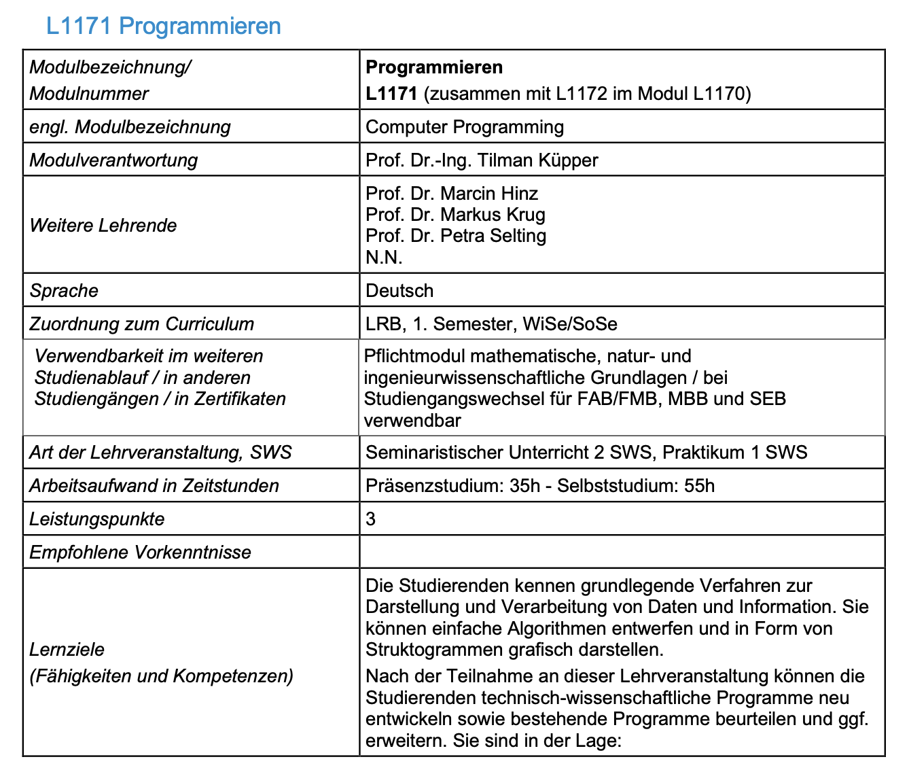
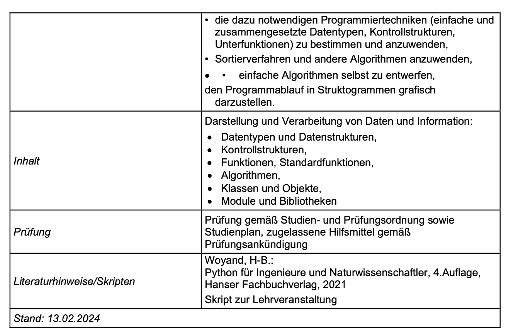

# Kurskonzept

## Empfohlende Arbeitsmaterialien
Entweder Sind Sie gerade auf einer interkativen Website unterwegs oder Sie haben ein Skript vor sich liegen. So oder so: Schritt 1 ist geschafft - Sie haben bereits mindestens einen Teil Ihrer Arbeitsmaterialien erfolgreich im Einsatz. 

Um die Inhalte der Vorlesung möglichst effizient zu konsumieren, empfehle ich Ihnen, dass sie die folgenden Arbeitsmaterialien nutzen: 
- die interaktive Website: 
- das Vorlesungs-Skript (eine PDF-Datei, die Sie in Ihrem Moodle-Kurs finden)

Die Website und das Skript sind thematisch identisch. 
Das Skript dient Ihnen dazu während der Vorlesung Notizen zu machen. 
Die interaktive Website ermöglicht Ihnen die in der Vorlesung gezeigten Programmierbeispiele direkt im Webbrowser auszuführen. So können Sie live während der Vorlesung die Beispiele ausführen oder, falls Ihnen das zu hektisch wird, die Beispiele in Ihrer Nachbereitung in Ruhe von zu Hause aus ausführen, abändern oder auch erweitern. 

## Welche Themen werden im Modul Programmieren behandelt?
In diesem Teilmodul lernen Sie Basis-Wissen aus der Informatik und Grundlagen der Programmiersprache Python. Ein grober Überblick über die Inhalte finden Sie - wie immer (!) - im Modulhandbuch Ihres Studiengangs:




Eine aktuelle Version des Modulhandbuchs finden Sie auf der Website der FK03: 

### Gliederung der Vorlesung

Die Vorlesung ist in 12 Kapitel unterteilt. Pro Vorlesung werden wir uns jeweils ein Kapitel ansehen. Die Reihenfolge der Kapitel und die Inhalte orientieren sich daran, wie ein Softwareentwickler in der Praxis Software entwickelt. Eine Übersicht dazu finden Sie in Abschnitt 2.

Damit Sie gute Programme entwickeln können, ist es notwendig, dass Sie grundsätzlich verstehen wie ein Computer funktioniert, wie Daten darauf verarbeitet werden, etc. etc. - also Basis-Informatik-Wissen. Informatik ist ein weites Feld- wir werden in diesem Kurs nur die theoretischen Grundlagen betrachten, mit denen Sie als Ingenieure in Ihrem Arbeitsalltag in Berührung kommen.  
Die einzelnen Kapitel setzen sich daher aus aus theoeretischen Inhalten und praktischen Inhalten zusammen. Zu Beginn eines jedes Kapitels sind die entsprechenden Lernziele definiert. Lernziele, Hinweise und Warnungen sind wie folgt gekennzeichnet: 


```{admonition} Lernziele
:class: learngoals
Am Anfang eines jedes Kapitels finden Sie die Lernziele für das jeweilige Kapitel. 
```

```{admonition} Hinweis
:name: remark-sample
:class: remark
Dies ist ein allgemeiner Hinweis.
```

```{admonition} Warnung
:class: attention
:name: attention-sample
Dies ist ein **wichtiger** Hinweis bzw. eine Warnung.
```

